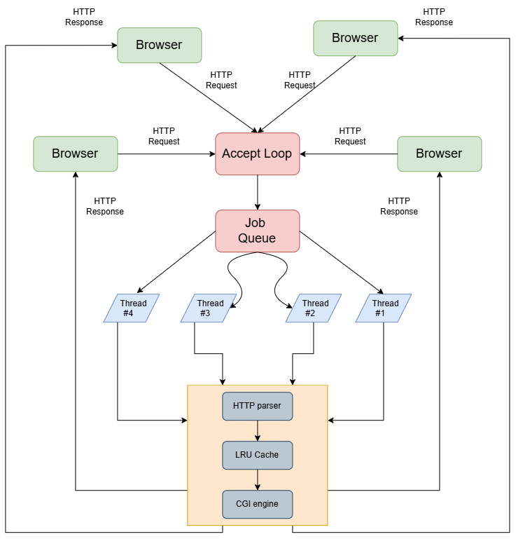

# The Simple Server ── A concurrent HTTP/1.1 web server in C

A configurable multi-threaded HTTP/1.1 web server with an LRU file cache and a CGI execution engine, written in C.

## Architecture

   

   > [!NOTE]
   > The `4` shown in the image is for illustration only. The default `thread_count` is `16` and can be changed in `server.conf`.
   - **Accept Loop**: The Server accepts connections continuously and pushes accepted sockets onto the Job Queue.
   - **Job Queue**: A mutex-protected FIFO queue decoupling connection acceptance from request handling as the first coming socket is the first served by the thread workers.
   - **Thread pool**: fixed N worker threads pulling from a mutex-protected queue, avoiding per-connection thread creation overhead.
   - **Thread Routine**: Each worker thread handles one connection at a time by:
      - **HTTP parser**: Parsing the HTTP Request using the standard format to extract information easily from it.
      - **LRU cache**: hash table of files for O(1) lookup combined with a doubly linked list for O(1) eviction, bounded by total bytes rather than entry count.
      - **CGI engine**: Detects CGI requests by path prefix, then executes the target script via fork/exec with full stdin/stdout pipe redirection and a configurable execution timeout.
      - **Sending HTTP Response** with the proper format to the client.
      - After that, the worker returns to the **Job Queue** and blocks until the next connection is available.

## Features

   - HTTP/1.1 server with persistent keep-alive connections 
   - Configurable at runtime via a config file without recompilation
   - Multi-threaded request handling via a fixed thread pool
   - In-memory LRU file cache with configurable byte limit
   - CGI script execution with full environment variable translation
   - MIME type detection for common file types
   - Correct HTTP error responses (400, 403, 404, 405, 500, 504, 505)
   - Graceful handling of malformed requests and hanging CGI scripts

## Build and run

### Prerequisites
- GCC, Make, CMake, and Python 3
- **Windows users: install [WSL](https://learn.microsoft.com/en-us/windows/wsl/install)
  and follow the Linux instructions inside WSL**

### Linux / macOS / WSL

```bash
# Build and run
./run.sh

# Build and run after a clean build
./run.sh clean

# Or using make directly
make        # build only
make run    # build and run
make clean  # clean build artifacts
```

### Config file

Place `server.conf` in the project root.
All fields are optional except data_root, which must contain an absolute path to the server's data directory.

> [!NOTE]
>> A `data/` folder is included inside `src/` with templates and CGI test files. You can use it as the server's data directory.

| Field                       |    Default | Description                                  |
| --------------------------- | ---------: | -------------------------------------------- |
| `data_root`                 |          — | Absolute path to the server data directory   |
| `port`                      |     `3490` | Port the server listens on                   |
| `thread_count`              |       `16` | Number of worker threads                     |
| `queue_size`                |       `50` | Maximum request queue size                   |
| `backlog`                   |       `10` | Socket listen backlog                        |
| `initial_timeout`           |        `5` | Initial connection timeout in seconds        |
| `default_keepalive_timeout` |       `30` | Default keep-alive timeout in seconds        |
| `max_keepalive_timeout`     |      `120` | Maximum keep-alive timeout in seconds        |
| `max_keepalive_requests`    |      `100` | Maximum requests per connection              |
| `cgi_timeout`               |        `5` | Maximum CGI execution time in seconds        |
| `cache_slots`               |     `1024` | Number of cache slots                        |
| `max_cache_bytes`           | `67108864` | Maximum cache size in bytes                  |
| `verbose`                   |        `0` | Enable verbose logging (`0` = off, `1` = on) |

### Verify it's working

Make sure `data_root` is correctly configured in `server.conf` before running these tests.

> [!NOTE]
> The port `3490` shown below is the default value in `server.conf`. If you changed the port, replace `3490` with your configured port.

```bash
# Request the default page
curl -v http://localhost:3490/

# Test CGI environment variables
curl -v http://localhost:3490/cgi-bin/env.py

# Test query string
curl -v "http://localhost:3490/cgi-bin/query.py?name=Ahmed"

# Test POST body
curl -v -X POST \
-H "Content-Type: application/x-www-form-urlencoded" \
-d "name=Ahmed&age=22" \
http://localhost:3490/cgi-bin/post.py
```


## Design Decisions

   - **Thread pool Vs spawning**
      > A fixed thread pool is used over per-connection thread spawning — thread creation carries significant overhead (stack allocation, OS scheduling) that compounds under load. Pre-allocated workers eliminate this overhead and bound memory usage regardless of connection volume.

   - **Separate chaining over open addressing for the cache hash table**
      > The cache hash table uses separate chaining for collision resolution rather than open addressing (linear probing, quadratic probing). Cache eviction means deletion is a primary operation — not an edge case. Open addressing schemes require tombstone markers or backward shift deletion to maintain probe chain integrity, adding complexity that compounds under concurrent access. Separate chaining reduces deletion to an O(1) linked list unlink with no side effects on other entries.

   - **Cache bounded by bytes rather than entry count**
      > Cache capacity is measured in total bytes consumed rather than number of entries. A fixed entry count limit is meaningless when entries vary from 2KB config files to 50MB assets — the same entry count could represent 10MB or 5GB of memory. Byte-based bounding gives precise control over actual memory consumption. Files exceeding the cache size limit bypass the cache entirely and are served directly from disk. 
   
   - **Single global mutex over striped locking for the LRU list**
      > Striped locking — partitioning the hash table across N independent mutexes — was considered as a cache concurrency optimization. The LRU doubly linked list is a globally ordered structure that every cache operation modifies regardless of which hash stripe the entry belongs to. Striped locking would reduce contention on hash lookups but the LRU list remains a single contention point requiring its own mutex, introducing lock ordering requirements between stripe mutexes and the LRU mutex. Given that the server's bottleneck is network I/O rather than cache lookup speed, a single cache mutex with documented limitations was chosen over the additional complexity.
   
   - **fork/exec over a thread-based CGI model**
      > CGI scripts execute as independent child processes via fork/exec rather than in worker threads. Process isolation means a misbehaving script cannot corrupt server memory or interfere with other requests — it crashes in its own address space and the server continues. Thread-based execution would share the server's memory space with untrusted script code, making isolation impossible without additional sandboxing.

   - **keep-alive connection limits**
      > Persistent connections are bounded by both an idle timeout (keepalive_timeout) and a maximum request count (keepalive_max_requests). The timeout alone cannot bound a persistently active client — a client making continuous requests would hold a worker thread indefinitely. The request count limit ensures worker threads rotate across clients regardless of connection activity level. 

## Limitations

   - Supports GET and POST only — PUT, DELETE, HEAD not implemented
   - No TLS/HTTPS support
   - No chunked transfer encoding
   - Cache invalidation not implemented — server restart required if files change on disk
   - CGI only, no FastCGI or WSGI support

## Future improvements

   - **Striped locking for the cache** — partition the hash table across N
   independent mutexes to reduce lock contention under high concurrency,
   once the LRU list contention point is addressed separately

   - **HTTP range requests** — support `Range` headers for partial content
   delivery, enabling resumable downloads and video seeking

   - **TLS support via a library** — add HTTPS support by integrating
   a TLS library (mbedTLS or OpenSSL) without reimplementing
   cryptography

   - **Config scripting language** — replace the current key-value config
   file with a small interpreted language supporting conditionals and
   variables, enabling per-route rules and dynamic configuration
   without recompilation

## References
   
   - The Internet's Architecture:
      - [The Internet's Layered Network Architecture](https://www.codequoi.com/en/internet-layered-network-architecture/)
   
   - HTTP/1.1 Specifications:
      - [RFC 7230: Hypertext Transfer Protocol (HTTP/1.1)](https://www.rfc-editor.org/info/rfc7230/)

   - Multi-threading :
      - [Beej's Guide to Network Programming](https://beej.us/guide/bgnet/)
      - [Multi-threading Vs Multi-processing](https://www.baeldung.com/cs/multiprocessing-multithreading)
      - [POSIX threads — pthread_create, mutex, and condition variables](https://embeddedprep.com/posix-threads-pthread/)

   - UNIX Tools in C :
      - [Creating and killing child processes in C](https://www.codequoi.com/en/creating-and-killing-child-processes-in-c/)
      - [fork and exec in C](https://thelinuxcode.com/fork-exec-coding-c/)
      - [The exec family of functions in C](https://www.geeksforgeeks.org/c/exec-family-of-functions-in-c/)
      - [Pipes — inter-process communication in C](https://www.codequoi.com/en/pipe-an-inter-process-communication-method/)

   - Common Gateway Interface :
      - [RFC 3875: The Common Gateway Interface (CGI)](https://www.rfc-editor.org/info/rfc3875/)
      - [CGI with python - Geeks for Geeks](https://www.geeksforgeeks.org/python/get-and-post-in-python-cgi/)
      - [A minimal CGI tutorial in C](https://www.eskimo.com/~scs/cclass/handouts/cgi.html) 
      
## AI Assistance
AI tools were used as development assistants throughout the project, including **ChatGPT, Claude, and GitHub Copilot**. They were used for debugging, documentation, brainstorming, and reviewing implementation ideas. All final design decisions, implementation, testing, and integration were done and verified by me.